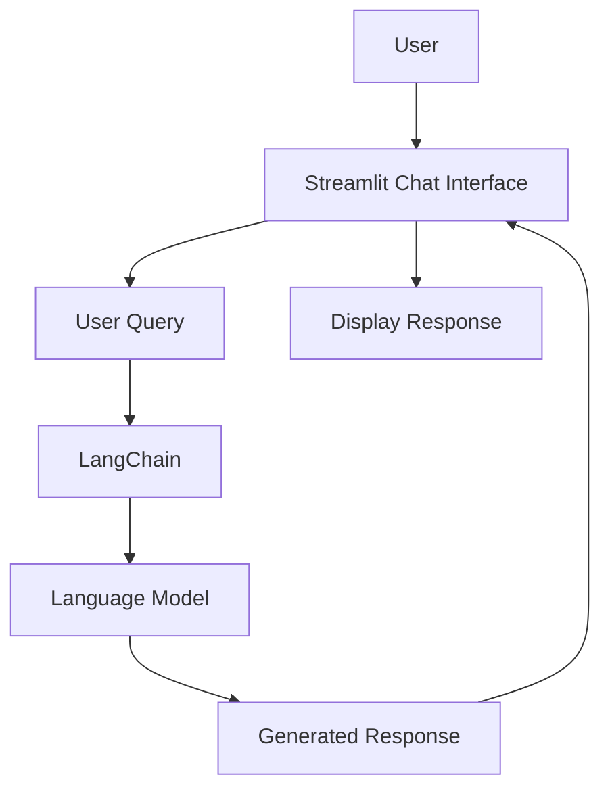

# 🤖 LangChain – GenAI Chatbot

An interactive Generative AI chatbot built using **Python, LangChain, and Streamlit**. The application demonstrates how Large Language Models (LLMs) can be integrated into a conversational interface to generate responses to user queries.

## 🚀 Live Demo

**[Try the LangChain GenAI Chatbot](https://langchain-genai-chatbot.streamlit.app/)**

## 📌 Project Overview

The LangChain GenAI Chatbot is a conversational AI application designed to explore the practical implementation of Large Language Models using the LangChain framework.

It provides a simple interface where users can submit questions and receive AI-generated responses, demonstrating the integration of LLMs with a Python-based application.

## ✨ Features

* Interactive conversational interface
* AI-powered responses to user queries
* LangChain-based LLM integration
* Streamlit web interface
* Real-time response generation
* Simple and user-friendly application

## 🛠️ Tech Stack

| Technology            | Purpose                                   |
| --------------------- | ----------------------------------------- |
| Python                | Core programming language                 |
| LangChain             | LLM application framework                 |
| Streamlit             | Web application interface                 |
| Large Language Models | AI response generation                    |
| Git & GitHub          | Version control and repository management |

## ⚙️ Application Workflow



## 📂 Project Structure

```text
LangChain/
│
├── app.py
├── requirements.txt
└── README.md
```

## 💻 Run Locally

### Prerequisites

* Python 3.10+
* Git
* Required LLM API key, if applicable

### 1. Clone the Repository

```bash
git clone https://github.com/praveenadurga135-commits/LangChain.git
```

### 2. Navigate to the Project

```bash
cd LangChain
```

### 3. Create a Virtual Environment

```bash
python -m venv venv
```

Activate on Windows:

```bash
venv\Scripts\activate
```

### 4. Install Dependencies

```bash
pip install -r requirements.txt
```

### 5. Configure Environment Variables

If your selected LLM provider requires an API key, create a `.env` file and add the corresponding environment variable.

```env
YOUR_API_KEY=your_api_key
```

Never commit secret API keys to GitHub.

### 6. Run the Application

```bash
streamlit run app.py
```

Open the local URL displayed in the terminal, typically:

```text
http://localhost:8501
```

## 🎯 Learning Outcomes

* Understanding the fundamentals of LangChain
* Integrating Large Language Models into Python applications
* Building interactive AI applications using Streamlit
* Understanding the flow of user prompts and generated responses
* Exploring practical Generative AI development

## 🔮 Future Enhancements

* Conversation memory
* Chat history management
* Support for multiple LLM providers
* Document-based question answering
* Retrieval-Augmented Generation (RAG)
* Improved conversational context handling

## 👩‍💻 Author

**Mandapaka Praveena Durga**

B.Tech – Computer Science and Engineering
Artificial Intelligence & Machine Learning

* GitHub: [praveenadurga135-commits](https://github.com/praveenadurga135-commits)
* Repository: [LangChain – GenAI Chatbot](https://github.com/praveenadurga135-commits/LangChain)
* Live Demo: [LangChain GenAI Chatbot](https://langchain-genai-chatbot.streamlit.app/)

---

⭐ If you find this project interesting, consider giving the repository a star.

**Built with Python, LangChain, and Generative AI.**
